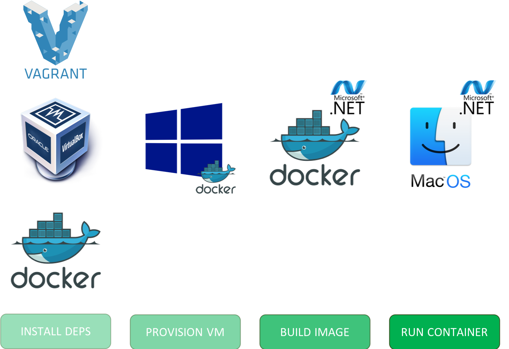
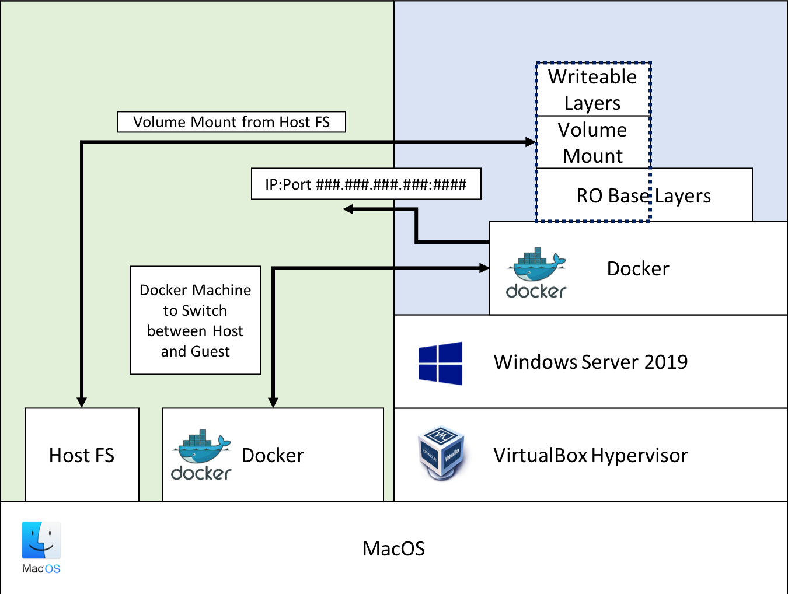

# windows-2019-docker

A repo demonstrating building and running Windows .NET applications on a Mac.

Please Note: Files make the assumption that they are being run on a Mac, and are particularly Mac specific.

## Background

It can be a pain point developing .NET applications on a Mac. The aim of this repo was to prove that the developer experience could be streamlined using modern tooling such as Docker.

Largely based on the [work by Stefan Scherer](https://github.com/StefanScherer/windows-docker-machine), as there is no point reinventing the wheel if someone has already done most of the legwork!

## Getting started

The project ships with both a `Makefile` and a `package.json` for the user's preference. In order to use the `package.json` you will require to have `npm` installed. You can also use `yarn`.

We will be using the `make` syntax for this readme. All commands have a `npm`/`yarn` equivalent, please refer to the `package.json` file.

### Setup Steps

To install and setup all the necessary infrastructure, build the development environment, and start the development server, run:

```console
make all
```

If you just need to rebuild / restart the Windows VM, run:

```console
make build-vm
```

If you just need to rebuild the development Docker image, run:

```console
make build-dev
```

If you already have the Windows VM running, and a development Docker image built from before, then to just start the development server, run:

```console
make run-dev
```

This will open a powershell console in your terminal to interact with the .NET files from within Windows. When this shell is terminated, the server will be shutdown.

If you have the development server running, you can view the sample application (currently not hot-reloaded) in the browser by running:

```console
make open
```

### Available Commands

Running the command `make` in the root directory will list available commands and descriptions:

```console
$ make

all                            Performs setup and starts dev experience.
build-dev                      Build the development Docker image.
build-prod                     Build the production Docker image.
build-vm                       Brings up the Windows VM.
clean                          Cleans up.
deps                           Install required dependencies.
open                           Opens the sample app in the browser.
run-dev                        Run the development Docker container.
run-prod                       Run the production Docker container.
```

## How it works

### Overview



1. We install [Vagrant](https://www.vagrantup.com/), [Oracle VM VirtualBox](https://www.virtualbox.org/) and [Docker](https://www.docker.com/) using [Homebrew](https://brew.sh/) onto your host machine.

   - Docker is a tool designed to make it easier to create, deploy, and run applications by using containers. Docker is a bit like a virtual machine. But unlike a virtual machine, rather than creating a whole virtual operating system, Docker allows applications to use the same Linux kernel as the system that they're running on, and only requires applications be shipped with things not already running on the host computer. This gives a significant performance boost and reduces the size of the application. We use Docker to build and run our .NET Framework sample application.
   - VirtualBox is an open-source hosted hypervisor for running and managing VMs. We use this to run our Vagrant Windows box.
   - Vagrant is used configure and supply a Windows 2019 Server Virtual Machine. This project originally used a tool called [Packer](https://www.packer.io/intro/) to build this Windows VM, but now opts to use a [prebuilt Windows box](https://app.vagrantup.com/StefanScherer/boxes/windows_2019_docker). This Windows Server has Docker installed, and is further configured with certificates so that it can be communicated with from the host machine using [Docker Machine](https://docs.docker.com/machine/).

1. We then use Vagrant to provision a Windows VM, using VirtualBox as the hypervisor. The reason we need this Windows VM is because .NET Framework applications can only be built on Windows. If you're wondering why can't we build a Windows Docker container for the .NET application, we will, but it will be in this Windows VM, because you cannot currently build Windows Docker containers on Linux / Mac as they are not supported by the Linux Kernel.

1. Once the Windows VM is built, we utilise a tool called Docker Machine. This allows us to manage remote Docker hosts, in this instance, the Docker Engine running on our Windows VM. By using Docker Machine, we swap to point to the Docker Engine running on the Windows VM, meaning our Docker CLI from the host can now instruct Docker on the VM, and thus command it to build Windows Docker containers. Specifically, we instruct it to build the image defined in our `dev.Dockerfile` in this repository.

1. Now we have a Windows VM with a Windows development Docker image which contains everything to build and run .NET framework apps. We can now instruct Docker to create a container based on this image and run it. What's more, we can use Docker's ability to mount file systems to mount our sample application code into this Docker container running on the Windows VM.

1. The end result is that we can edit our applications code and, as the directory has been mounted onto the container, this is picked up by IIS and the website reloaded with our changes. All we need to do is open the site on the correct IP (the IP of the Windows Docker Host) and port (as configured in our container run command) and we can view the app running live in a browser on our host machine.

### High Level Architecture


